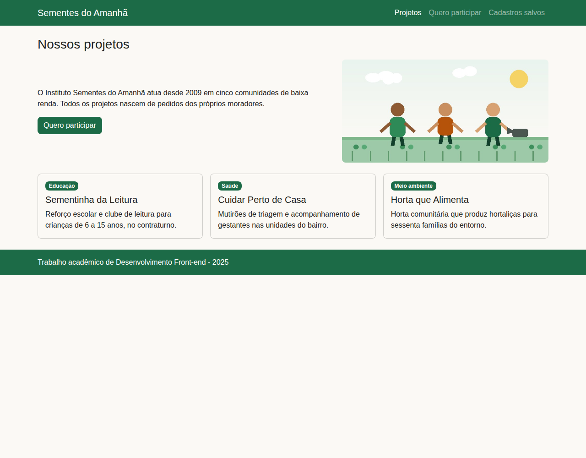
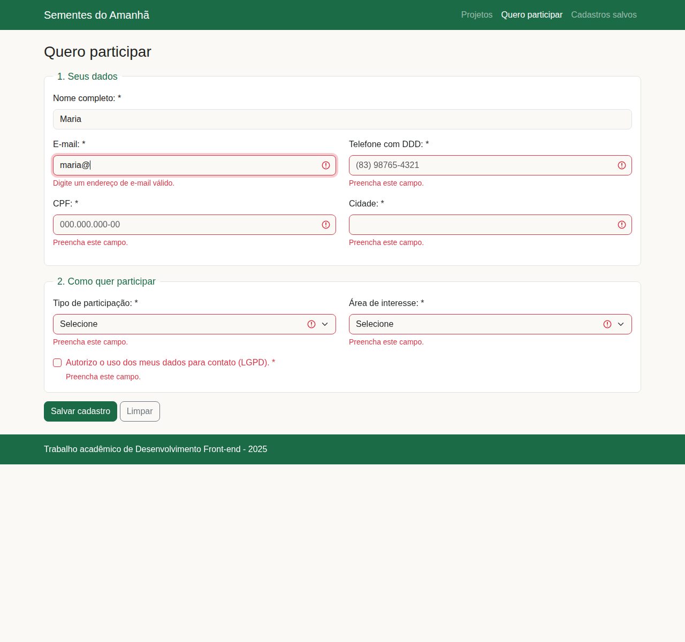
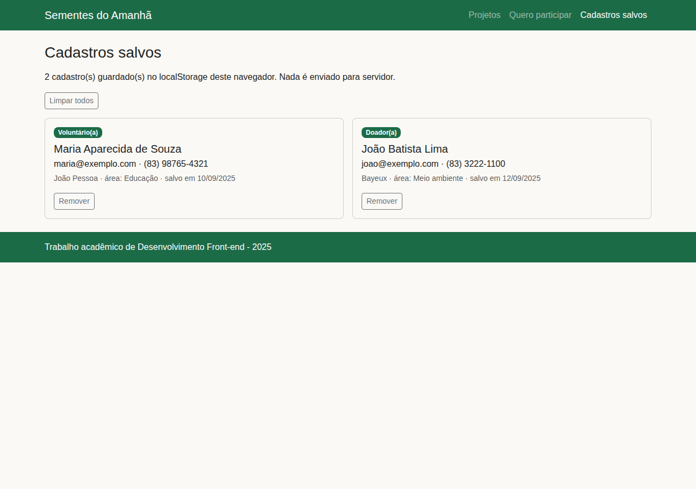
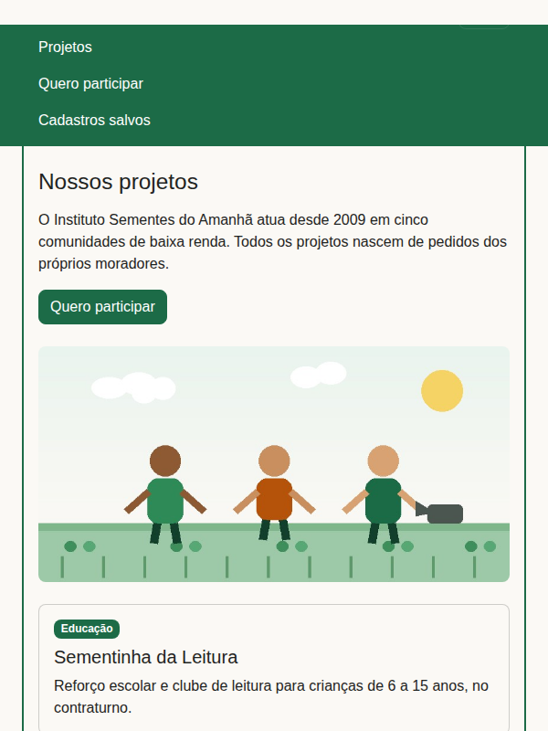

# Instituto Sementes do Amanhã — SPA

Aplicação de página única (SPA) do site institucional de uma ONG fictícia, desenvolvida como Experiência Prática da disciplina de **Desenvolvimento Front-end**. A navegação acontece sem recarregar a página, as telas são geradas por templates em JavaScript, o formulário valida os dados com feedback na tela e os cadastros ficam guardados no `localStorage` do navegador.

## Índice

- [Sobre o projeto](#sobre-o-projeto)
- [Capturas](#capturas)
- [Tecnologias](#tecnologias)
- [Estrutura de pastas](#estrutura-de-pastas)
- [Pré-requisitos](#pré-requisitos)
- [Como rodar localmente](#como-rodar-localmente)
- [Build para produção](#build-para-produção)
- [Testes](#testes)
- [Acessibilidade](#acessibilidade)
- [Versionamento](#versionamento)
- [Publicação](#publicação)
- [Documentação adicional](#documentação-adicional)
- [Licença](#licença)

## Sobre o projeto

O site tem três telas, todas servidas pelo mesmo documento:

| Rota | Tela | O que faz |
| --- | --- | --- |
| `#/inicio` | Projetos | apresenta os projetos da ONG, gerados a partir de um array de dados |
| `#/cadastro` | Quero participar | formulário com máscaras de CPF e telefone, validação com feedback e gravação local |
| `#/cadastros` | Cadastros salvos | lista o que foi gravado no `localStorage`, com remover e limpar |

Qualquer outro endereço cai numa tela de "página não encontrada".

O roteamento é feito por hash (`#/rota`), o que dispensa configuração de servidor e faz os botões voltar e avançar do navegador funcionarem sem código extra.

## Capturas

| | |
| --- | --- |
|  |  |
|  |  |

A captura `capturas/05-foco-teclado.png` mostra o link "Pular para o conteúdo principal" aparecendo no primeiro <kbd>Tab</kbd>.

## Tecnologias

| Tecnologia | Versão | Onde é usada |
| --- | --- | --- |
| HTML5 | — | `html/index.html`, com marcos semânticos (`header`, `nav`, `main`, `footer`) |
| CSS3 | — | `css/style.css`, com variáveis no `:root` e layout em grid e flexbox |
| JavaScript | ES2019+ | `js/*.js`, em módulos IIFE, com template literals, `map`/`filter`, eventos e `localStorage` |
| Bootstrap | 5.3.3 | grid, componentes e comportamentos (menu, toast), em arquivos locais |
| esbuild | 0.25 | minificação do CSS e dos módulos JavaScript no build |
| axe-core | 4.10 | auditoria automática de acessibilidade |
| Node.js | 18+ | execução do build e das verificações |
| Git e GitHub | — | versionamento, issues, milestones, pull requests e releases |

Não há framework de JavaScript (React, Vue e afins) no projeto: a SPA é escrita em JavaScript puro. O motivo está em [`docs/ARQUITETURA.md`](docs/ARQUITETURA.md).

## Estrutura de pastas

```
college-frontend-1/
├── html/          index.html, o único documento da aplicação
├── css/           bootstrap.min.css (framework) e style.css (tema do projeto)
├── js/            dados.js, telas.js, formulario.js e app.js, mais o bundle do Bootstrap
├── img/           imagem usada na tela de projetos
├── capturas/      prints das telas, usados no relatório
├── scripts/       build.mjs, que gera a pasta dist/
├── testes/        verificar.mjs (verificações) e acessibilidade.mjs (axe-core)
├── docs/          arquitetura, acessibilidade e versionamento
└── dist/          resultado do build (não versionado)
```

## Pré-requisitos

- **Node.js 18 ou superior** (testado no 20 e no 22) e npm — necessários apenas para o build e as verificações;
- **Git** para clonar o repositório;
- **Google Chrome ou Chromium** apenas se você quiser rodar a auditoria de acessibilidade.

Para simplesmente abrir o site não é preciso instalar nada: o projeto não tem dependências de execução e o Bootstrap está versionado dentro dele.

## Como rodar localmente

```bash
# 1. clonar
git clone https://github.com/PedroPereiraGoncalves/college-frontend-1.git
cd college-frontend-1

# 2. instalar as dependências de desenvolvimento (esbuild e axe-core)
npm install
```

Depois, escolha uma das formas de abrir:

**Sem servidor** — dê dois cliques em `html/index.html`. Funciona porque os scripts são clássicos e o Bootstrap está local.

**Com servidor local** (mais próximo de produção):

```bash
python3 -m http.server 8000
# e acesse http://localhost:8000/html/index.html
```

## Build para produção

```bash
npm run build
```

O script `scripts/build.mjs` faz três coisas: minifica o CSS do tema e **agrupa os quatro módulos JavaScript num arquivo só** com o esbuild, copia o Bootstrap e a imagem, e reescreve os caminhos do `index.html` (que em desenvolvimento saem de `html/` com `../`). O resultado vai para `dist/`, pronta para publicar, e o documento passa a carregar **um** script do projeto em vez de quatro.

Saída do build neste projeto:

```
css/style.css      3,6 KB ->  1,8 KB
js/ (4 módulos)   21,2 KB -> 13,0 KB  (num arquivo só: js/app.min.js)
total             24,8 KB -> 14,8 KB  (40% menor, antes do gzip)
```

A imagem também é otimizada: vai em **WebP** (8,4 KB) com o JPG de reserva (24,8 KB) para navegadores antigos, servidos por `<picture>`.

## Testes

```bash
npm test        # verificações do código, sem dependências externas
npm run a11y    # auditoria de acessibilidade com axe-core
```

`npm test` roda o `testes/verificar.mjs` e confere: a sintaxe dos quatro módulos, se toda classe usada no HTML e nos templates tem estilo definido, se todo `getElementById` encontra o elemento, se os requisitos de acessibilidade já corrigidos continuam no lugar e se todos os campos do formulário têm rótulo e mensagem de erro.

`npm run a11y` injeta o axe-core nas três telas, **nos dois temas**, dentro de um navegador headless, roda as regras de WCAG 2.1 níveis A e AA e ainda confere a ordem de foco. Se o Chrome não estiver no caminho padrão, informe onde ele está:

```bash
CHROME=/usr/bin/google-chrome npm run a11y
```

## Acessibilidade

O projeto segue as diretrizes **WCAG 2.1 nível AA**. O que está implementado:

- contraste mínimo de 4,5:1 no texto, incluindo os links do menu e os botões de contorno;
- link "Pular para o conteúdo principal" como primeiro elemento focável (2.4.1);
- foco levado para o conteúdo a cada troca de tela, com contorno visível em `:focus-visible` (2.4.3);
- `aria-current="page"` no link do menu correspondente à tela aberta (4.1.2);
- rótulos em todos os campos, mensagens de erro abaixo de cada um e aviso em região viva (3.3.1, 4.1.3);
- `autocomplete` nos campos, para identificar o propósito de cada um (1.3.5);
- textos alternativos nas imagens e idioma declarado no documento;
- **tema claro e escuro**, com a escolha guardada no `localStorage`, a preferência do sistema respeitada na primeira visita e contraste AA verificado nos dois modos.

O relatório completo da auditoria, com as razões de contraste medidas antes e depois, está em [`docs/ACESSIBILIDADE.md`](docs/ACESSIBILIDADE.md).

## Versionamento

O repositório segue o **GitFlow**:

| Branch | Papel |
| --- | --- |
| `main` | código em produção; só recebe merge de release ou de hotfix, sempre com tag |
| `develop` | integração; é dela que toda branch de trabalho nasce e para onde volta |
| `feature/*` | uma funcionalidade ou etapa por branch, integrada por pull request |
| `hotfix/*` | correção urgente em cima do que já está publicado |

As mensagens seguem o padrão **Conventional Commits** (`feat`, `fix`, `docs`, `build`, `test`, `chore`), com escopo quando ajuda a localizar o assunto: por exemplo `fix(a11y): corrige contraste dos links do menu`. As versões seguem **versionamento semântico** (MAJOR.MINOR.PATCH): `feat` sobe a MINOR, `fix` e `hotfix` sobem a PATCH, e mudança que quebre endereços ou estrutura sobe a MAJOR.

Histórico de releases e o passo a passo para contribuir estão em [`docs/VERSIONAMENTO.md`](docs/VERSIONAMENTO.md).

## Publicação

O deploy é contínuo: o workflow do GitHub Actions roda o build e publica a pasta `dist/` no GitHub Pages a cada push na `main` (issue [#5](https://github.com/PedroPereiraGoncalves/college-frontend-1/issues/5)). O endereço público é adicionado aqui assim que o workflow entrar.

## Documentação adicional

- [`docs/ARQUITETURA.md`](docs/ARQUITETURA.md) — como a SPA foi organizada, decisões técnicas e fluxo dos dados;
- [`docs/ACESSIBILIDADE.md`](docs/ACESSIBILIDADE.md) — auditoria WCAG 2.1 AA, antes e depois;
- [`docs/VERSIONAMENTO.md`](docs/VERSIONAMENTO.md) — branches, commits, releases e como contribuir.

## Licença

Distribuído sob a licença MIT. O conteúdo institucional e a imagem são fictícios, criados para o trabalho acadêmico.
